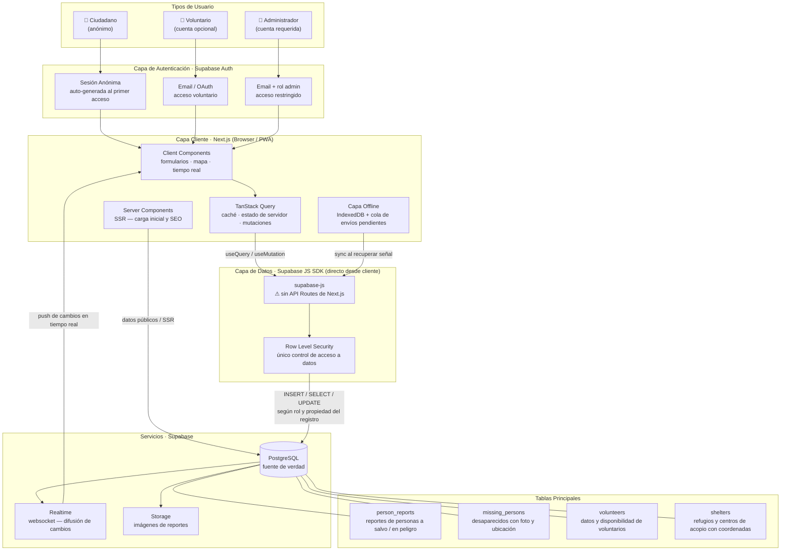

# Arquitectura de Capas — VenezuelaSOSApp

## Diagrama

## Descripción de Capas

### Usuarios y Autenticación

| Tipo | Auth | Permisos |
|------|------|----------|
| Ciudadano | Sesión anónima automática (Supabase anonymous auth) | Crear y ver reportes; buscar desaparecidos; ver refugios |
| Voluntario | Email / OAuth (opcional) | Todo lo anterior + gestionar su perfil de voluntario |
| Administrador | Email con rol `admin` | Verificar/moderar reportes; crear y actualizar refugios |

La sesión anónima se crea automáticamente al primer acceso — el usuario nunca ve una pantalla de login salvo que quiera crear una cuenta de voluntario.

### Capa Cliente (Next.js)

- **Server Components**: cargan datos públicos en SSR (lista de refugios, conteos). Sin JS enviado al cliente; buenos para SEO y primera carga rápida.
- **Client Components**: formularios de reporte, mapa interactivo, suscripciones Realtime. Nunca hacen `fetch` directo — siempre a través de TanStack Query.
- **TanStack Query**: capa de estado de servidor entre los Client Components y el SDK de Supabase. Gestiona caché, revalidación, estados de carga/error y mutaciones optimistas. `QueryProvider` está en `src/providers/query-provider.tsx` y envuelve toda la app desde `layout.tsx`.
- **Capa Offline**: los formularios guardan el payload en IndexedDB. Un Service Worker detecta reconexión y dispara los envíos pendientes.

### TanStack Query — Convenciones

| Concepto | Patrón |
|----------|--------|
| Funciones de acceso a datos | `src/lib/queries/<módulo>.ts` (ej: `shelters.ts`) |
| Query keys | `['tabla', { filtros }]` — ej: `['shelters', { city: 'Caracas' }]` |
| Lecturas (SELECT) | `useQuery` |
| Escrituras (INSERT / UPDATE / DELETE) | `useMutation` |
| `staleTime` global | 30 segundos |
| `retry` global | 1 (conservar datos móviles) |

### Seguridad (RLS)

Como no hay API Routes, las políticas de Row Level Security en PostgreSQL son la **única barrera de seguridad**. Reglas clave:

- Cualquier sesión (anónima o autenticada) puede leer datos públicos.
- Solo el creador del registro (por `user_id`) puede editarlo.
- Solo el rol `admin` puede modificar la tabla `shelters` y verificar reportes.
- Nunca exponer datos de contacto privados a sesiones anónimas.

### Distribución en Tiempo Real

Supabase Realtime transmite cambios de la base de datos vía websocket a todos los clientes suscritos. Casos de uso:

- Nuevo refugio disponible → el mapa se actualiza en todos los dispositivos conectados.
- Persona reportada como a salvo → el reporte de desaparecido se marca automáticamente.
